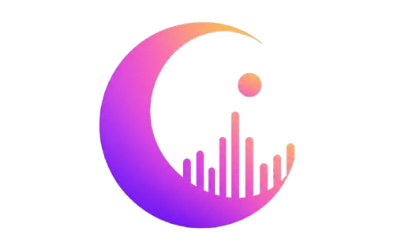

  

> **The Discovery Layer for Music**

Discover music the way you discover videos.

Instead of searching through playlists, Moon lets you **scroll**, **discover**, and **fall in love** with your next favorite song.

---

## 🎵 Why Moon?

Today's music platforms are built for **search**.
Moon is built for **discovery**.

Think of it as an infinite feed where every swipe introduces you to a new track — powered by community engagement, real trends, and the people you follow, not a playlist you made once and forgot about.

---

## ✨ Features

- 🎧 Infinite vertical music feed
- ❤️ Like & save songs
- 💬 Comments & discussions
- 📤 Share tracks instantly
- 👥 Follow artists & friends
- 🌍 Global trending feed — today / this week / this month / this year
- 🎯 Personal feed — what your friends and follows are into, right now
- 📊 Artist analytics *(coming soon)*

---

---

## 🧭 How we're building this

Instagram launched with just square photos. Snapchat launched with just a disappearing photo. Spotify ran invite-only for over a year before it opened up, and its "smart" recommendations didn't exist until years of real listening data existed to build them from.

None of them launched broad. They launched small, real, and closed — then earned their way out.

Moon follows the same playbook:

1. **Ship the smallest real loop first** — feed, like, comment. No algorithm yet.
2. **Launch into one scene, invite-only** — starting with independent hip-hop/rap artists, not the whole internet.
3. **Let real usage decide what's next** — retention over vibes, evidence over timelines.
4. **Earn the smart stuff** — recommendations and ranking get built once there's real behavior to train them on, not before.

We're not trying to out-Spotify Spotify on day one. We're trying to build the one thing it's missing: a feed that feels alive.

---

## 🛣️ Roadmap

- [x] Product vision
- [ ] Content licensing decision (originals vs. sourced)
- [ ] Authentication
- [ ] Music feed (chronological + trending)
- [ ] Closed invite-only launch — one scene
- [ ] User profiles
- [ ] Artist profiles
- [ ] Social feed (friends & follows)
- [ ] Recommendation engine
- [ ] Creator dashboard
- [ ] **Movies vertical** *(later — same account, follow-graph, and feed backbone; new content type, TMDB metadata instead of licensing, users log/rate instead of stream)*

---

## 🎯 Vision

We're not trying to replace Spotify.
We're building **the place where people discover what they'll listen to next.**

Music is the wedge. Once the core discovery loop works, the same bones extend to other taste — starting with movies — without rebuilding the app from scratch.

---

## 🤝 Contributing

Moon is currently in active development, launching small and closed on purpose.
If you're interested in contributing, opening issues, or sharing ideas, we'd love to hear from you.

---

## 👨‍💻 Team

**~Sunil**

Built with ❤️ for music lovers like me.
